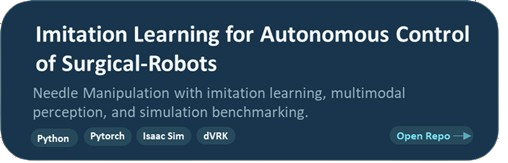
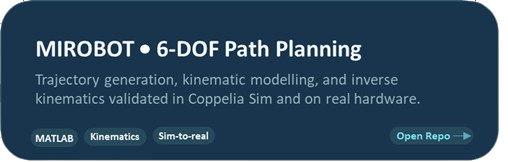
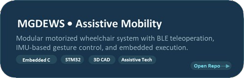

<!--
  ╔══════════════════════════════════════════════════════════════╗
  ║     ANUBHAV TYAGI — GITHUB PROFILE README                   ║
  ║     Premium Portfolio Edition v3.0                          ║
  ╚══════════════════════════════════════════════════════════════╝
-->

 

 

&nbsp;

&nbsp;

&nbsp;

 

 

  <picture>
    <source media="(prefers-color-scheme: dark)" srcset="https://raw.githubusercontent.com/platane/platane/output/github-contribution-grid-snake-dark.svg"/>
    <source media="(prefers-color-scheme: light)" srcset="https://raw.githubusercontent.com/platane/platane/output/github-contribution-grid-snake.svg"/>
    
  </picture>

 

## 🔬 Currently Building

<table align="center" width="100%">
<tr>
<td width="33%" valign="top" align="center">

### 🦾 Sant'Anna School  
**Research Associate**  
*Institute of BioRobotics*

Advancing human-robot interaction, sensing systems, and translational robotics research at the Institute of BioRobotics.

</td>
<td width="33%" valign="top" align="center">

### 🏥 NeuroReach Technologies  
**MedTech Research Engineer**

Contributing to next-generation medical technology concepts at the intersection of neuroscience, robotics, and early-stage product development.

</td>
<td width="33%" valign="top" align="center">

### 🎓 Imperial College London  
**MRes Researcher**  
*Medical Robotics & IGI*

Research on autonomous surgical robot control through imitation learning, visual feedback, and simulation-based benchmarking.

</td>
</tr>
</table>

 

## 📌 Featured Repositories

&nbsp;

  

 

## ⚡ Impact at a Glance

| 🎯 Needle Manipulation | 📉 Data Collection | 🧠 Sensor Precision | 📊 Fall Detection | 🏆 Classification |
|:---:|:---:|:---:|:---:|:---:|
| **98% Success Rate** | **68% Faster Pipeline** | **80% IMU Accuracy** | **2,981 Unique Samples** | **97% k-NN Accuracy** |
| dVRK Multi-phase | Isaac Sim + ORBIT | 3D-Printed Calibration | 31 Fall/ADL Classes | Supervised Learning |

 

## 🛠️ Technical Arsenal

<table align="center" width="100%">
<tr>
<td width="25%" valign="top" align="center">

 

</td>
<td width="25%" valign="top" align="center">

 

</td>
<td width="25%" valign="top" align="center">

 

</td>
<td width="25%" valign="top" align="center">

 

</td>
</tr>
</table>

 

## 📅 Career Journey

<table align="center" width="90%">

<tr>
<td width="8%" align="center">🔵</td>
<td width="92%">

<table width="100%">
<tr>
<td width="50%">

**Research Associate** · Sant'Anna / Institute of BioRobotics  
`🟢 Current` · Bio-inspired robotics · Human-robot interaction

</td>
<td width="50%">

**MedTech Research Engineer** · NeuroReach Technologies  
`🟢 Current` · Medical device engineering · Neurotechnology

</td>
</tr>
</table>

</td>
</tr>

<tr>
<td align="center">🟣</td>
<td>

**MRes Medical Robotics** · Imperial College London  
`Sep 2024 – Sep 2025` · `🏅 Distinction` · Hamlyn Symposium Poster · Surgical Robot Control via Imitation Learning

</td>
</tr>

<tr>
<td align="center">⚫</td>
<td>

**Embedded Systems Intern** · Endoenergy Systems, India  
STM32 · CAN Protocol · IMU Calibration · Exoskeleton Firmware Development

</td>
</tr>

<tr>
<td align="center">🔴</td>
<td>

**Automation Trainee** · Al Wahdania General Trading, UAE  
SIEMENS PLC · Delta HMI · Production Floor Automation

</td>
</tr>

<tr>
<td align="center">🟡</td>
<td>

**B.Tech Electronics & Communications** · UPES University  
`🏅 Distinction` · IEEE Student Branch Secretary · Student Placement Representative

</td>
</tr>

</table>

 

## 🔭 Research Interests

 

 

## 📣 Publications & Presentations

| Type | Title | Venue | Year |
|:----:|-------|-------|:----:|
| 📄 **Poster** | Autonomous Surgical Robot Control via Imitation Learning | Hamlyn Symposium on Medical Robotics | `2025` |
| 🎓 **Thesis** | Imitation Learning for Autonomous Control of Surgical Robots | Imperial College London | `2025` |

 

## 🏆 Accomplishments

| Badge | Achievement | Details |
|:-----:|-------------|---------|
| 🏅 | **Research Grant** | INR 1.5 Lakh — Oil Tank Robot (SHODH Project) |
| 🎓 | **Hamlyn Symposium** | Poster Presenter — Medical Robotics 2025 |
| 🏛️ | **IEEE Leadership** | Secretary, UPES IEEE Student Branch |
| 🎖️ | **Student Representative** | Placement Representative, UPES ECE 2024 |
| ⚡ | **Hackathon Organiser** | Co-organiser, UPES Embedded Systems Hackathon |

 

### 🤝 Open To Opportunities

 

  

